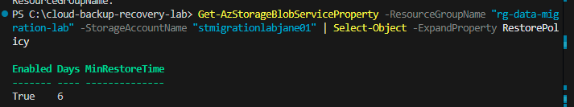
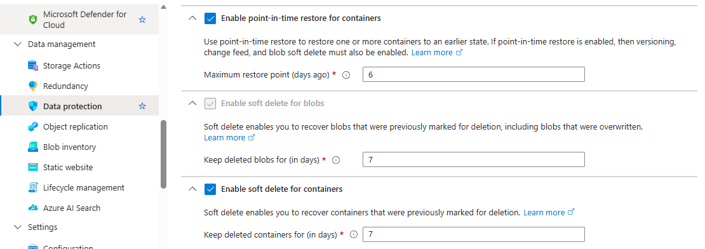
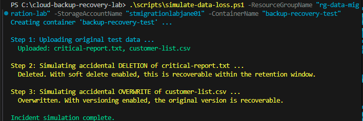
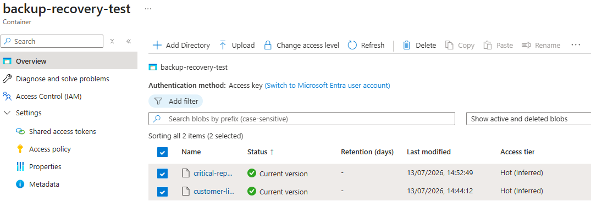
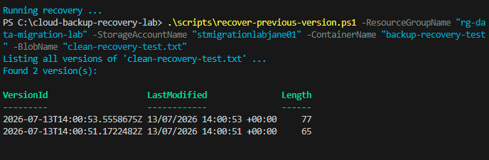
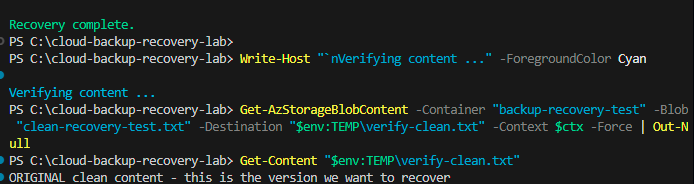

# Data Backup & Recovery Lab

**Accidental deletion and accidental overwrite recovery, built entirely on
native Azure Storage features - no separate backup service, no additional
compute, no cost beyond the storage account already in use.**

Backup and recovery is one of the most universally required capabilities in
any organisation handling customer or financial data: regulators expect it,
auditors check for it, and the difference between "we can restore that" and
"that data is gone" is frequently the difference between an inconvenience and
a genuine incident. This lab implements and proves recovery from the two most
common real-world data loss scenarios - accidental deletion and accidental
overwrite - using Azure Blob Storage's built-in protection features rather
than a separately licensed backup product.

## Why Native Storage Features, Not Azure Backup (the Named Service)

Azure Backup (the dedicated backup service, with Recovery Services vaults) is
the enterprise-standard tool for VM, database, and file share backup at
scale. For blob storage specifically, its capability is built directly on top
of the same soft delete, versioning, and change feed features this lab
configures directly - using Azure Backup's "Operational Backup for Blobs"
wrapper adds vault-based policy management, but does not add any protection
capability beyond what's demonstrated here. For a single storage account,
configuring these features directly is simpler, equally effective, and keeps
this lab's footprint to resources already in use rather than requiring a new
vault resource. docs/architecture.md covers where the vault-based service
earns its complexity at larger scale.

## What's Included

| Component | Purpose |
|---|---|
| [`scripts/enable-protection-features.ps1`](scripts/enable-protection-features.ps1) | Enables soft delete, versioning, and point-in-time restore on the storage account |.
| [`scripts/simulate-data-loss.ps1`](scripts/simulate-data-loss.ps1) | Creates test data, then simulates an accidental deletion and an accidental overwrite. |
| [`scripts/recover-deleted-blob.ps1`](scripts/recover-deleted-blob.ps1) | Recovers the accidentally deleted blob via soft delete. |
| [`scripts/recover-previous-version.ps1`](scripts/recover-previous-version.ps1) | Recovers the pre-overwrite version of a blob via versioning .|
| [`docs/architecture.md`](docs/architecture.md) | RPO/RTO concepts, design rationale, and where Azure Backup's vault-based model earns its cost. |
| [`docs/architecture-diagram.md`](docs/architecture-diagram.md) | Visual diagram of the protection features, incidents, and unified recovery mechanism .|
| [`docs/setup-guide.md`](docs/setup-guide.md) | Full reproduction steps with screenshot evidence point.s |
| [`docs/screenshots/`](docs/screenshots/) | Evidence of both recovery scenarios actually working. |

## Protection Features Demonstrated

| Feature | Protects Against | Recovery Mechanism |
|---|---|---|
| Blob soft delete | Accidental or malicious deletion. | Deleted blob remains recoverable for a configured retention window. |
| Blob versioning | Accidental overwrite or corruption. | Every previous version of a blob is retained and individually restorable. |
| Point-in-time restore | Broader accidental changes across many blobs. | Restore an entire container to its state at a specific timestamp. |

## Cost

Every feature here is a storage account configuration setting, not a billed
service in its own right:
- **Soft delete and versioning**: no activation cost - you pay only for the
  storage consumed by retained deleted/previous versions, which at this
  lab's data volume is negligible.
- **Point-in-time restore**: requires versioning and change feed to be
  enabled first (both free to enable); the restore operation itself has no
  separate charge.

## Screenshots

Evidence of both recovery scenarios, captured against a live Azure
subscription during this build. Files live in docs/screenshots/.

**1. Protection Features Enabled**

Soft delete, versioning, change feed, and point-in-time restore all
confirmed active via PowerShell verification output.
This is the baseline configuration every recovery scenario in this project
depends on - without it, neither incident below would be recoverable at all.

**2. Data Protection Portal View**

The same configuration confirmed directly in the Azure Portal.
Checking both the CLI output and the portal view matters in practice - it's
the difference between trusting a script's exit code and actually verifying
the setting took effect where it's meant to.

**3. Incident Simulation**

Test data uploaded, then deliberately deleted and overwritten - creating
real incidents to recover from.
Both failure modes were triggered in the same run deliberately, so the
recovery steps that follow are proven against genuine incidents rather than
a hypothetical description of what soft delete or versioning "should" do.

**4. Deleted Blob Recovered**

The accidentally deleted file restored to "Current version" status.
Getting this working required discovering that versioning intercepts
deletion before soft delete's own recovery path does - documented in full
in docs/architecture.md.

**5. Previous Version Restored**

A clean two-version recovery cycle: exactly one original and one corrupted
version identified, with the original correctly restored.
Run on a fresh blob name specifically to keep the evidence unambiguous,
after repeated test runs on the original file accumulated enough version
history to make "the previous version" genuinely ambiguous.

**6. Content Verification**

The recovered file's actual content confirmed as the original, not the
corrupted overwrite - proof the recovery worked, not just that the script
exited without error.
This step is the one most tutorials skip - a script reporting success and a
recovery actually being correct are two different claims, and only one of
them is proven by output text alone.
## Setup Guide

Full steps: [`docs/setup-guide.md`](docs/setup-guide.md).

## Skills Demonstrated

- **Data protection architecture**: soft delete, versioning, and point-in-time
  restore as complementary (not redundant) protection layers.
- **RPO/RTO reasoning**: understanding recovery point and recovery time
  objectives as the actual design question behind "how much backup is enough".
- **Incident recovery procedure**: a documented, tested, repeatable recovery
  process for both accidental deletion and accidental overwrite.
- **Cost-aware architecture decisions**: recognising when native platform
  features are sufficient versus when a dedicated backup service's cost is
  justified.

## Author

Jane - Cloud & Infrastructure Engineer, AZ-104 candidate.
Builds on the storage account and infrastructure established in the
On-Premise to Cloud Data Migration & Storage Design Lab.
