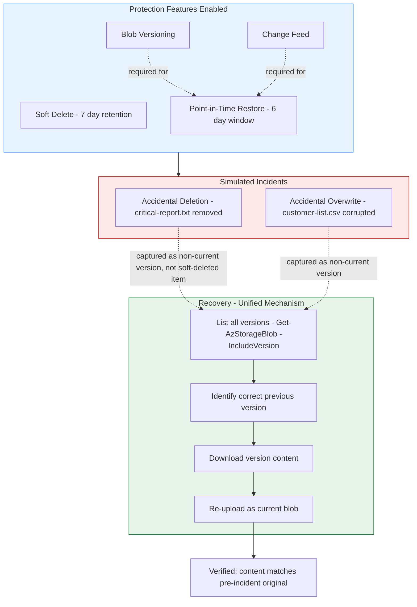

# Architecture Diagram

## Reading This Diagram

**Setup (top, blue):** four protection features configured on the storage
account, with the dependency between versioning/change feed and point-in-time
restore made explicit.

**Incidents (middle, red):** the two failure modes this lab deliberately
simulates - a full deletion and a content overwrite - modelling the most
common real-world data loss scenarios.

**Recovery (bottom, green):** the key finding from this lab's build. Both
incident types were expected to route through different recovery mechanisms
(soft delete's Undelete() for deletion, versioning for overwrite) but with
both features enabled together, both actually route through the same
version-based recovery path - deletion doesn't produce a standalone
soft-deleted item when versioning is active; it produces a non-current
version, identical in shape to an overwrite. This is documented in detail in
docs/architecture.md, and is the kind of platform interaction that's only
visible once you've built and tested against it directly.